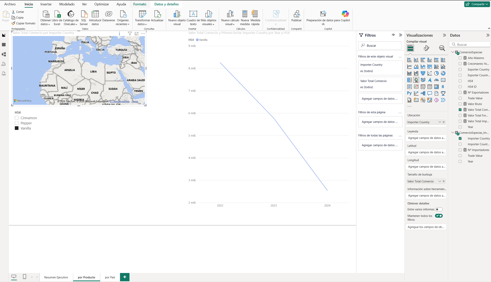
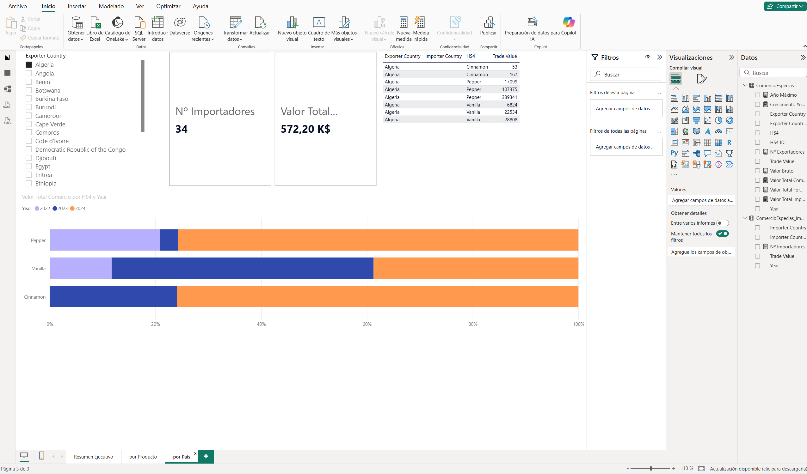
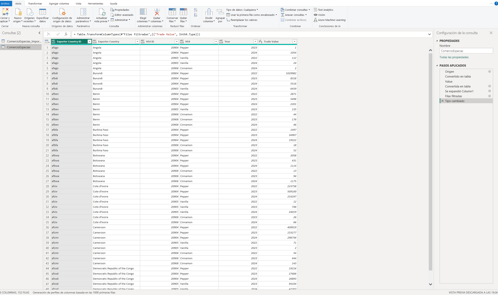

# 🌶️ Spice Market Dashboard — Power BI

[](https://powerbi.microsoft.com/)
[](https://learn.microsoft.com/es-es/dax/)
[](https://learn.microsoft.com/es-es/power-query/)
[](https://oec.world/)
[](LICENSE)
[]()

Dashboard interactivo para el análisis del **mercado global de especias**, construido con **Power BI Desktop** a partir de datos de comercio internacional de la **API de la OEC (Observatory of Economic Complexity)**.


---

## 📌 Objetivo

Analizar el comercio internacional de especias (códigos HS 0904–0910) desde múltiples perspectivas:

- **Valor total** exportado e importado
- **Ranking** de países exportadores e importadores
- **Evolución temporal** (2022–2024)
- **Desglose por tipo de especia** (pimienta, vainilla, canela, etc.)
- **Distribución geográfica** mediante mapas interactivos

---

## 🛠️ Tecnologías utilizadas

<p align="center">
  
  
  
</p>

| Herramienta | Uso |
|---|---|
| **Power BI Desktop** | Modelado, DAX y visualización |
| **Power Query (M)** | Extracción y transformación del JSON de la API |
| **DAX** | Medidas de negocio (KPIs, YoY, rankings) |
| **API de OEC** | Fuente de datos de comercio internacional |

---

## 📊 Estructura del dashboard

### Página 1 — Resumen Ejecutivo
- KPIs: Valor Total, Nº Exportadores, Nº Importadores, Año Máximo
- Gráfico de anillos por tipo de especia
- Top 10 exportadores por valor comercial

### Página 2 — Por Producto
- Análisis temporal por especia
- Mapa geográfico de flujos comerciales
- Gráfico de líneas de evolución anual

### Página 3 — Por País
- Slicer de país exportador
- Tabla detalle por producto (Cinnamon, Pepper, Vanilla)
- Barras apiladas al 100 % por año

---

## 🔄 Fuente de datos

Los datos provienen de la **API pública de la OEC**:

```
https://api-v2.oec.world/tesseract/data.jsonrecords
```

Con los siguientes parámetros:

- `cube=trade_i_baci_a_22`
- `drilldowns=Year,Exporter+Country,HS4`
- `measures=Trade+Value`
- `limit=50000`

Posteriormente se filtran en Power Query los códigos HS de especias:
`0904, 0905, 0906, 0907, 0908, 0909, 0910`.

---

## 📂 Estructura del repositorio

```
spice-market-dashboard/
│
├── powerbi/
│   ├── Spice_Market_Dashboard.pbix        # Proyecto Power BI
│   ├── docs/
│   │   ├── Documento Técnico.docx         # Documentación técnica
│   │   └── Documento Técnico.pdf          # Versión PDF
│   └── screenshots/                        # Capturas del dashboard
│       ├── 01_resumen_ejecutivo.png
│       ├── 02_por_producto.png
│       ├── 03_por_pais.png
│       └── 04_modelo_datos.png
│
├── presentacion.pptx                       # Presentación ejecutiva
├── LICENSE
└── README.md
```

---

## 🚀 Cómo abrir el proyecto

### 1. Clonar el repositorio

```bash
git clone https://github.com/jdthgp27/spice-market-dashboard.git
cd spice-market-dashboard
```

### 2. Abrir Power BI Desktop

Abre el archivo `powerbi/Spice_Market_Dashboard.pbix` con **Power BI Desktop**.

### 3. Actualizar datos

Si los datos no se cargan automáticamente:
- Ve a **Inicio → Actualizar**
- Power BI ejecutará las consultas a la API de OEC
- Se cargarán los datos actualizados

### 4. Requisitos

- **Power BI Desktop** (gratuito) → [descargar](https://powerbi.microsoft.com/desktop/)
- Conexión a internet (para actualizar desde la API)

---

## 📸 Capturas del dashboard

### Resumen Ejecutivo


### Análisis por Producto



### Análisis por País



### Modelo de datos



---

## 📘 Documentación técnica

El proceso completo de construcción, con las incidencias encontradas y sus soluciones, está documentado en:

- 📄 [Documento Técnico (PDF)](powerbi/docs/Documento%20T%C3%A9cnico.pdf)
- 📝 [Documento Técnico (DOCX)](powerbi/docs/Documento%20T%C3%A9cnico.docx)

---

## 🎯 Conclusiones de negocio

El dashboard permite:

- **Identificar los principales exportadores** de especias a nivel global
- **Detectar tendencias de crecimiento** por tipo de especia
- **Analizar flujos comerciales** entre países
- **Priorizar mercados** para la expansión de operaciones

---

## 🔄 Próximas mejoras

- [ ] Añadir más años de datos históricos
- [ ] Incorporar predicciones con SARIMA o Prophet
- [ ] Publicar el dashboard en Power BI Service (web)
- [ ] Añadir análisis de precios medios por especia

---

## 👤 Autor

**Judit Giravent Pineda**

- GitHub: [@jdthgp27](https://github.com/jdthgp27)
- LinkedIn: [judit-giravent-27b167156](https://www.linkedin.com/in/judit-giravent-27b167156/)
- Email: jdthgp27@gmail.com

---

## 📜 Licencia

Este proyecto está bajo la **Licencia MIT**. Consulta el archivo [LICENSE](LICENSE) para más detalles.

---

⭐ Si este proyecto te ha resultado útil, considera darle una estrella en GitHub.