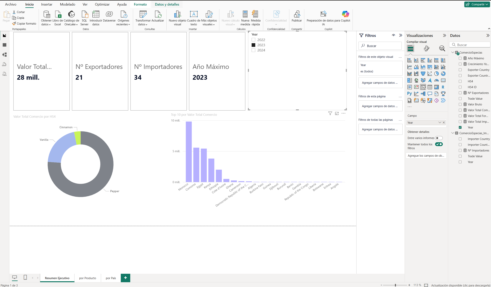

# 🌶️ Spice Market Dashboard — Power BI

Dashboard interactivo para el análisis del mercado global de especias, construido con **Power BI Desktop** a partir de datos de comercio internacional de la **API de la OEC (Observatory of Economic Complexity)**.



---

## 📌 Objetivo

Analizar el comercio internacional de especias (códigos HS 0904–0910) desde múltiples perspectivas:

- Valor total exportado e importado.
- Ranking de países exportadores e importadores.
- Evolución temporal (2022–2024).
- Desglose por tipo de especia (pimienta, vainilla, canela, etc.).
- Distribución geográfica mediante mapas interactivos.

---

## 🛠️ Tecnologías utilizadas

| Herramienta | Uso |
|---|---|
| **Power BI Desktop** | Modelado, DAX y visualización |
| **Power Query (M)** | Extracción y transformación del JSON de la API |
| **DAX** | Medidas de negocio (KPIs, YoY, rankings) |
| **API de OEC** | Fuente de datos de comercio internacional |

---

## 📊 Estructura del dashboard

### Página 1 — Resumen Ejecutivo
- KPIs: Valor Total, Nº Exportadores, Nº Importadores, Año Máximo.
- Gráfico de anillos por tipo de especia.
- Top 10 exportadores por valor comercial.

### Página 2 — Por Producto
- Análisis temporal por especia.
- Mapa geográfico de flujos comerciales.
- Gráfico de líneas de evolución anual.

### Página 3 — Por País
- Slicer de país exportador.
- Tabla detalle por producto (Cinnamon, Pepper, Vanilla).
- Barras apiladas al 100 % por año.

---

## 🔄 Fuente de datos

Los datos provienen de la **API pública de la OEC**:

https://api-v2.oec.world/tesseract/data.jsonrecords


Con los siguientes parámetros:

- `cube=trade_i_baci_a_22`
- `drilldowns=Year,Exporter+Country,HS4`
- `measures=Trade+Value`
- `limit=50000`

Se filtran posteriormente en Power Query los códigos HS de especias:
`0904, 0905, 0906, 0907, 0908, 0909, 0910`.

---

## 📂 Estructura del repositorio


├── powerbi/
│ ├── Spice_Market_Dashboard.pbix
│ └── screenshots/
├── docs/
│ └── Documento_Tecnico.pdf
└── README.md


---

## 🚀 Cómo abrir el proyecto

1. Clona el repositorio:
   ```bash
   git clone https://github.com/TU_USUARIO/spice-market-dashboard.git

Abre powerbi/Spice_Market_Dashboard.pbix con Power BI Desktop.

Si los datos no se cargan, ve a Inicio → Actualizar para refrescar la consulta desde la API.

📘 Documentación técnica
El proceso completo de construcción, con las incidencias encontradas y sus soluciones, está documentado en:

docs/Documento_Tecnico.pdf

👤 Autor
Judit Giravent

LinkedIn: linkedin.com/in/judit-giravent-27b167156

GitHub: @jdthgp27

📜 Licencia
Este proyecto está bajo la licencia MIT. Consulta el archivo LICENSE para más detalles.